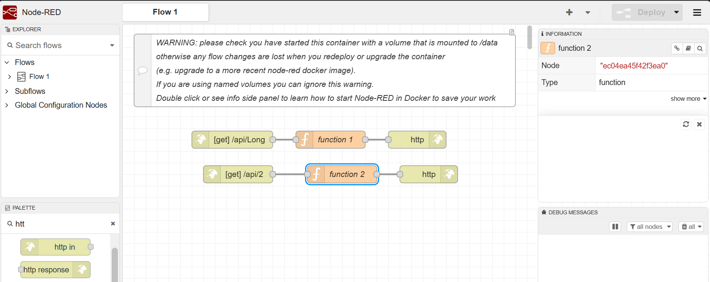
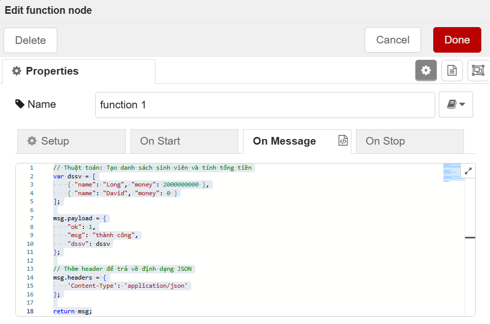
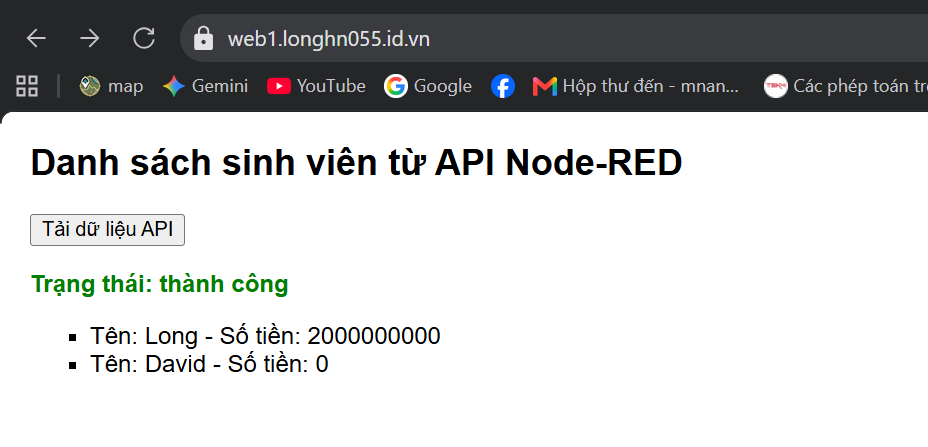

# Bài tập 1

## Lịch sử Cập nhật 

### 22-09-2026
    - Đăng ký domain (xịn) trên web matbao
    - Join domain vào Cloudflare để quản lý

### 23-09-2026
    - Cài đặt môi trường: cài ubuntu trên wsl
    - Cài Docker compose
    - cài trên docker compose : các dịch vụ: nginx, nodered, mariadb, phpmyadmin, cloudflared
    - Tạo tunnel trong cloudflare
    - Cấu hình nginx để chạy 2 web khác nhau

### 24-09-2026
-  Cài đặt Git trên máy để kết nối với tài khoản Github
-  Đẩy thư mục lên Github bằng Git
-  Bổ sung file .gitignore để ẩn file `.env` và các thư mục rác.

### 25-09-2026
- Đẩy lại các file lên github (sửa lỗi bảo mật)
- Sử dụng nodered để tạo API đơn giản
- Cấu hình nodered để web dùng js gọi được API
- Code js  vào html để gọi được api trên
- Thêm readme.md để báo cáo bài tập

# Bài tập 2

### Yêu cầu 1

### Yêu cầu 2

### Yêu cầu 3

# An toàn và bảo mật thông tin

## 1. Thuật toán DES và AES
### a. DES
        - Thuật toán DES (Data Encryption Standard - Tiêu chuẩn Mã hóa Dữ liệu) là một thuật toán mã hóa đối xứng (Symmetric Encryption Algorithm) từng là tiêu chuẩn quốc tế cho việc bảo mật dữ liệu. DES sử dụng cùng một khóa bí mật (Secret Key) cho cả hai quá trình: mã hóa và giải mã.
        - Khóa của DES có độ dài tổng cộng 64-bit, nhưng trên thực tế chỉ có 56-bit được dùng làm khóa mã hóa thực sự. 8-bit còn lại được dùng để kiểm tra chẵn lẻ (parity checking). Dữ liệu 64-bit được chia làm 2 nửa (mỗi nửa 32-bit), sau đó trải qua 16 vòng (16 rounds) biến đổi toán học phức tạp.
        - Quá trình giải mã DES tuân theo nguyên lý mã hóa đối xứng theo mạng Feistel: Quy trình giải mã hoàn toàn giống với quy trình mã hóa, chỉ khác thứ tự sử dụng các khóa con bị đảo ngược. Nếu quá trình mã hóa sử dụng danh sách khóa con theo thứ tự: K1, K2, K3,..., K16, thì quá trình giải mã sẽ sử dụng thứ tự: K16, K15, K14,..., K1.
       
        - Quy trình mã hóa: Biến đổi văn bản rõ thành bản mã không thể đọc được nếu không có khóa bí mật (Key).
            - Tiền xử lý dữ liệu (Padding & Parsing): Dữ liệu đầu vào được chia thành các khối (block) có kích thước cố định. Nếu khối cuối cùng không đủ độ dài, thuật toán sẽ chèn thêm các bit đệm.
            - Khởi tạo và Sinh khóa con (Key Schedule): Khóa chính ban đầu (Secret Key) được đưa qua một thuật toán sinh khóa để tạo ra tập hợp các khóa con phục vụ cho từng vòng biến đổi.
            - Biến đổi ban đầu (Initial Transformation / Permutation): Khối dữ liệu đi qua bước hoán vị hoặc cộng khóa ban đầu để xáo trộn cấu trúc ban đầu.
            - Thực hiện các vòng lặp biến đổi (Rounds): Dữ liệu liên tục trải qua nhiều vòng biến đổi toán học gồm 4 thao tác chính:
                - Thay thế: Thay thế các bit/byte dữ liệu dựa trên bảng thế cố định để tạo tính xáo trộn.
                - Hoán vị / Đảo dòng: Trộn lẫn vị trí các bit hoặc dòng để tạo tính khuếch tán.
                - Trộn cột / Trộn dữ liệu: Nhân toán học các khối dữ liệu để tạo sự phụ thuộc giữa các bit.
                - Cộng khóa vòng: Thực hiện phép toán XOR giữa dữ liệu hiện tại với khóa con của vòng đó.
            - Hoán vị kết thúc (Final Permutation): Khối dữ liệu sau vòng cuối cùng đi qua bước hoán vị nghịch đảo để cho ra sản phẩm cuối cùng là bản mã (Ciphertext).
        
        - Quy trình giải mã: Khôi phục bản mã trở lại văn bản rõ gốc bằng cách sử dụng khóa bí mật.
            - Sinh khóa con (Key Schedule): Khóa bí mật gốc được dùng để tính toán lại danh sách các khóa con (Subkeys). Điểm khác biệt cốt lõi: Thứ tự áp dụng các khóa con bị đảo ngược hoàn toàn.
            - Hoán vị ban đầu của giải mã: Khối bản mã đầu vào được đưa qua bước hoán vị ngược.
            - Thực hiện các vòng giải mã ngược: Dữ liệu chạy qua các vòng biến đổi với các thao tác được tính ngược lại: Phép toán XOR với khóa con tương ứng (phép XOR có tính chất đảo ngược: ((A XOR B) XOR B) = A ). 
                - Bảng thế nghịch đảo: Khôi phục lại các giá trị byte/bit ban đầu. 
                - Hoán vị nghịch đảo / Đảo ngược dịch dòng: Trả các bit/byte về vị trí ban đầu.
            - Loại bỏ bit đệm: Sau khi khôi phục dữ liệu 64-bit hoàn chỉnh, các bit đệm thêm vào ở giai đoạn mã hóa sẽ bị cắt bỏ để trả lại văn bản rõ gốc.

### b. AES
        - AES (Advanced Encryption Standard - Tiêu chuẩn Mã hóa Nâng cao) là thuật toán mã hóa đối xứng hiện đại, được viện NIST (Mỹ) công nhận làm tiêu chuẩn mã hóa quốc tế từ năm 2001 để thay thế cho thuật toán DES đã cũ và kém an toàn. Hiện nay, AES là tiêu chuẩn mã hóa được sử dụng rộng rãi nhất trên toàn thế giới (từ các ứng dụng nhắn tin, VPN, tài chính - ngân hàng đến bảo mật cấp chính phủ).
        - Mã hóa đối xứng: Sử dụng cùng một khóa bí mật (Secret Key) cho cả quá trình mã hóa và giải mã.
        - Độ dài khóa: Hỗ trợ 3 kích thước khóa khác nhau tùy thuộc vào mức độ bảo mật yêu cầu:
            - AES-128: Khóa 128-bit (chạy 10 vòng biến đổi).
            - AES-192: Khóa 192-bit (chạy 12 vòng biến đổi).
            - AES-256: Khóa 256-bit (chạy 14 vòng biến đổi) — đây là chuẩn bảo mật cao nhất, dùng cho dữ liệu cực kỳ nhạy cảm.
        - Mạng thay thế - hoán vị: Khác với mô hình Feistel của DES, AES xử lý toàn bộ 128-bit dữ liệu song song trong mỗi vòng, giúp tối ưu hóa hiệu năng cực cao.

        - Quy trình mã hóa:
            - Sinh khóa con: Thuật toán sử dụng khóa chính (Secret Key) để tính toán và sinh ra các khóa vòng tương ứng với số vòng thực hiện.
                - Bước sinh khóa (Key Schedule) có nhiệm vụ từ một Khóa chính gốc (Master Key) tính toán và sinh ra danh sách các Khóa vòng (Round Keys).
                - Mỗi khóa vòng cho từng vòng biến đổi đều có kích thước cố định bằng kích thước khối dữ liệu là 128-bit (4 từ - words, với 1 word = 32-bit = 4 byte).
                - Số khóa vòng luôn bằng (Số vòng + 1) (bao gồm 1 khóa vòng khởi tạo K0 + khóa vòng cho từng vòng chính):
                    - AES-128: Cần 11 khóa vòng (tương ứng 11 x 4 = 44 words).
                    - AES-192: Cần 13 khóa vòng (tương ứng 13 x 4 = 52 words).
                    - AES-256: Cần 15 khóa vòng (tương ứng 15 x 4 = 60 words).
            - Vòng khởi tạo: AddRoundKey (Cộng khóa vòng 0): Thực hiện phép toán XOR giữa ma trận dữ liệu đầu vào (4 x 4 byte) với khóa vòng đầu tiên (K0).
            - Các vòng lặp chính (Main Rounds - từ vòng 1 đến vòng N-1): Mỗi vòng chính trong AES bao gồm 4 bước biến đổi toán học:
                - SubBytes (Thay thế byte): Thay thế từng byte trong ma trận trạng thái bằng một byte khác dựa trên một bảng thế cố định phi tuyến tính gọi là S-Box. Bước này tạo ra tính xáo trộn cho dữ liệu.
                - ShiftRows (Dịch dòng): Dịch chuyển vòng các byte trên mỗi dòng của ma trận trạng thái sang bên trái theo các khoảng cố định:
                        - Dòng 0: Không dịch.
                        - Dòng 1: Dịch trái 1 byte.
                        - Dòng 2: Dịch trái 2 byte.
                        - Dòng 3: Dịch trái 3 byte.
                - MixColumns (Trộn cột):Thực hiện nhân toán học từng cột của ma trận trạng thái với một ma trận cố định trong trường Galois GF(2^8). Thao tác này làm cho mỗi byte đầu ra phụ thuộc vào tất cả các byte ở đầu vào của cột đó, tạo tính khuếch tán.
                - AddRoundKey (Cộng khóa vòng): Thực hiện phép XOR giữa ma trận trạng thái hiện tại với khóa vòng thứ $i$ ($K_i$) tương ứng.
            - Vòng cuối cùng (Final Round - Vòng N: )Thực hiện tương tự vòng chính nhưng bỏ qua bước MixColumns: SubBytes -> ShiftRows -> AddRoundKey KN. Kết quả thu được cuối cùng chính là khối Bản mã (Ciphertext) 128-bit
        
        - Quy trình giải mã: Giải mã AES thực hiện các bước toán học ngược lại hoàn toàn so với mã hóa, và sử dụng thứ tự khóa con bị đảo ngược (KN -> K0).
            - Khởi tạo: AddRoundKey: XOR bản mã với khóa vòng cuối cùng (KN).
            - Các vòng giải mã chính (từ vòng N-1 lùi về vòng 1):
                - InvShiftRows (Đảo dịch dòng): Dịch chuyển các byte trên các dòng sang phải (Dòng 0 dịch 0, Dòng 1 dịch 1, Dòng 2 dịch 2, Dòng 3 dịch 3).
                - InvSubBytes (Đảo thay thế byte): Sử dụng bảng thế ngược ((S-Box)^-1) để khôi phục byte về giá trị gốc.
                - AddRoundKey: XOR với khóa vòng Ki tương ứng.
                - InvMixColumns (Đảo trộn cột): Nhân cột với ma trận nghịch đảo trong trường Galois GF(2^8).
            - Vòng giải mã cuối cùng: InvShiftRows -> InvSubBytes -> AddRoundKey với khóa gốc (K0). Kết quả thu được chính là Văn bản rõ gốc (Plaintext)

### c. Cài đặt mã hóa và giải mã AES trên ngôn ngữ Python
   - [Xem mã nguồn Python AES Backend tại đây](./AESBackend/main.py)

